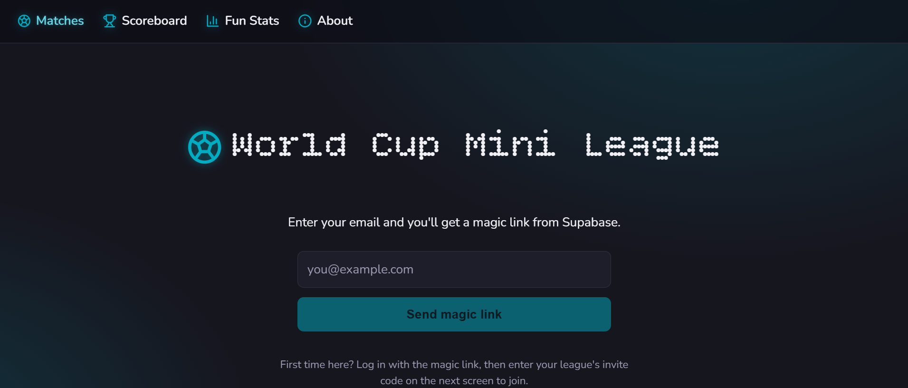
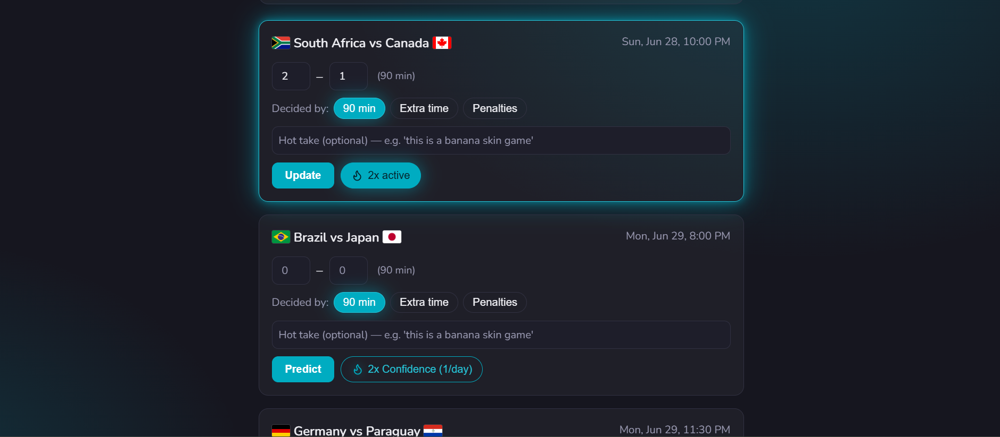
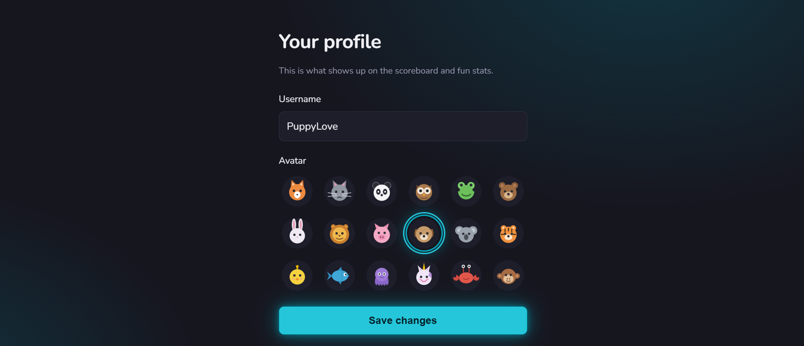

# World Cup Mini League

A small, private World Cup prediction game for a group of friends. Predict the
**knockout-stage** matches of the 2026 World Cup, earn points for how close you
get, and climb a shared leaderboard. It's just for bragging rights — no money,
no stakes, only eternal glory (or until everyone forgets about it two days after
the final).

## Features

- **Per-match predictions** — call the score of each upcoming knockout match,
  and pick how it's decided: 90 minutes, extra time, or penalties. Scores are
  validated (and a draw must go to penalties), and a saved pick locks the card
  until you hit **Change prediction**.
- **Once-a-day Confidence 2×** — double the points on the one match you feel
  surest about each day.
- **Predictions lock at kickoff** — automatically, and enforced on the server
  so nobody can sneak a late guess in.
- **Shared leaderboard** — total points per player, with ties broken by whose
  predicted scores landed closest to the real results.
- **Automatic scoring** — when a knockout match ends, real results are pulled
  in and everyone's predictions are scored within a few minutes. Nothing to
  refresh, no scores typed in by hand.
- **Knockout bracket** — a "Road to the Final" overview of the whole knockout
  tree that updates after every result; hover or tap any tie to trace where its
  teams came from and where they go next.
- **Prediction recap** — a "What did we predict?" page that lines up everyone's
  picks under each finished result, with a bit of playful ribbing for anyone who
  forgot to predict.
- **Match reactions & Fun Stats** — react to finished matches ("VAR robbed
  me", "Called it", "Devastated"…) and earn playful awards: biggest upset
  callers, shootout psychics, the most delusional predictors, and a reaction
  leaderboard.
- **Hot takes** — add a one-line comment to any prediction.
- **Tidy your view** — colour-coded match cards (upcoming, live, finished) and a
  one-click toggle to hide finished matches once the list gets long.
- **Group-stage results** — past group games are shown for reference (they
  aren't predicted).
- **Profiles** — pick a display name and a cartoon animal avatar.
- **Magic-link login** — sign in with a link sent to your email, no password
  to remember.

## Screenshots

<table>
  <tr>
    <td align="center">
      <br />
      <sub><b>Magic-link login</b></sub>
    </td>
    <td align="center">
      <br />
      <sub><b>Predicting matches</b></sub>
    </td>
    <td align="center">
      <br />
      <sub><b>Your profile</b></sub>
    </td>
  </tr>
</table>

## Table of contents

- [How it works](#how-it-works)
- [Run it locally](#run-it-locally)
  - [1. Install](#1-install)
  - [2. Set up Supabase](#2-set-up-supabase)
  - [3. Configure your environment](#3-configure-your-environment)
  - [4. Seed fixtures and start the app](#4-seed-fixtures-and-start-the-app)
- [Tests](#tests)
- [Deploy to production (Vercel)](#deploy-to-production-vercel)
- [Using a different competition](#using-a-different-competition)
- [License](#license)

## How it works

- Match data comes from a free public football API
  ([football-data.org](https://www.football-data.org), competition code `WC`).
  A scheduled job polls it and writes results back.
- Only knockout matches are predictable; group games are stored for display.
- Predictions lock at kickoff — enforced by the database (Row Level Security),
  not just the UI. When a knockout match finishes, the sync job runs the scoring
  function and points appear on the scoreboard.
- Scoring is a single Postgres function (`calculate_match_scores`); the tiers
  are documented in [`supabase/schema.sql`](supabase/schema.sql).

**Stack:** SvelteKit (Svelte 5) · Supabase (Postgres + Auth + Row Level
Security) · [football-data.org](https://www.football-data.org) for fixtures and
results · deployed on Vercel with a GitHub Actions cron for score syncing.

## Run it locally

Want to try it on your own machine? Here's the full path from zero to a running
app. You'll need free accounts on two services (Supabase and football-data.org),
both covered below.

### 1. Install

You need [Node.js](https://nodejs.org) 18 or newer (works on 22). Then, from the
project folder:

```bash
npm install
cp .env.example .env   # creates your local settings file — you'll fill it in below
```

### 2. Set up Supabase

[Supabase](https://supabase.com) is the free database + login service the app
runs on.

1. Create a project. From **Project Settings → API**, copy the project URL,
   the publishable/anon key, and the secret/service-role key.
2. In the **SQL Editor**, run the whole of [`supabase/schema.sql`](supabase/schema.sql).
   This creates the tables, security rules, the scoring function, and the stats
   views.
3. Go to **Authentication → Providers** and enable **Email**. Then under **URL
   Configuration**, set the Site URL and add `<site>/auth/callback` as a
   redirect URL (`http://localhost:5173/auth/callback` for local development).
4. Create your league and pick an invite code to share with friends:
   ```sql
   insert into leagues (name, invite_code, created_by)
   values ('Our World Cup League', 'YOUR-INVITE-CODE', null);
   ```

### 3. Configure your environment

Open the `.env` file you created earlier and fill in these values (never commit
this file):

| Variable | Where it comes from |
|---|---|
| `PUBLIC_SUPABASE_URL` | Supabase → Project Settings → API |
| `PUBLIC_SUPABASE_ANON_KEY` | Supabase (publishable/anon key) |
| `SUPABASE_SERVICE_ROLE_KEY` | Supabase (secret key — server-side only) |
| `FOOTBALL_DATA_TOKEN` | [football-data.org dashboard](https://www.football-data.org/client/register) (free token) |
| `CRON_SECRET` | any long random string you choose |

### 4. Seed fixtures and start the app

```bash
npm run seed   # pulls all World Cup matches into the database (re-run to refresh the bracket)
npm run dev
```

Open the local URL it prints (usually `http://localhost:5173`), log in with a
magic link, enter your invite code on the `/join` screen, and you're in.

## Tests

```bash
npm test                                        # API-parsing unit tests (Vitest)
node --env-file=.env scripts/verify-scoring.js  # checks every scoring tier against the real DB function
```

## Deploy to production (Vercel)

Once it runs locally, here's how to put it online so your friends can use it.

1. Push the project to GitHub and import the repo at
   [vercel.com/new](https://vercel.com/new).
2. Add the same variables from your `.env` file as Vercel environment variables.
3. Deploy, then add your new Vercel URL to Supabase's Site URL + redirect URLs
   (same place as step 3 of the local setup).
4. Score syncing runs via
   [`.github/workflows/sync-scores.yml`](.github/workflows/sync-scores.yml)
   every 15 minutes. Add two **GitHub Actions secrets** — `CRON_SECRET` and
   `SYNC_URL` (`https://<your-domain>/api/cron-sync-scores`). The workflow reads
   both from secrets, so no deployment URL is committed to the repo.

> **Note:** the Vercel adapter is pinned to `nodejs22.x`.

## Using a different competition

To target a tournament other than the 2026 World Cup, change the football-data
competition code (`WC`) in
[`scripts/seed-matches.js`](scripts/seed-matches.js) and
[`src/routes/api/cron-sync-scores/+server.js`](src/routes/api/cron-sync-scores/+server.js).

## License

MIT — do whatever you like.
